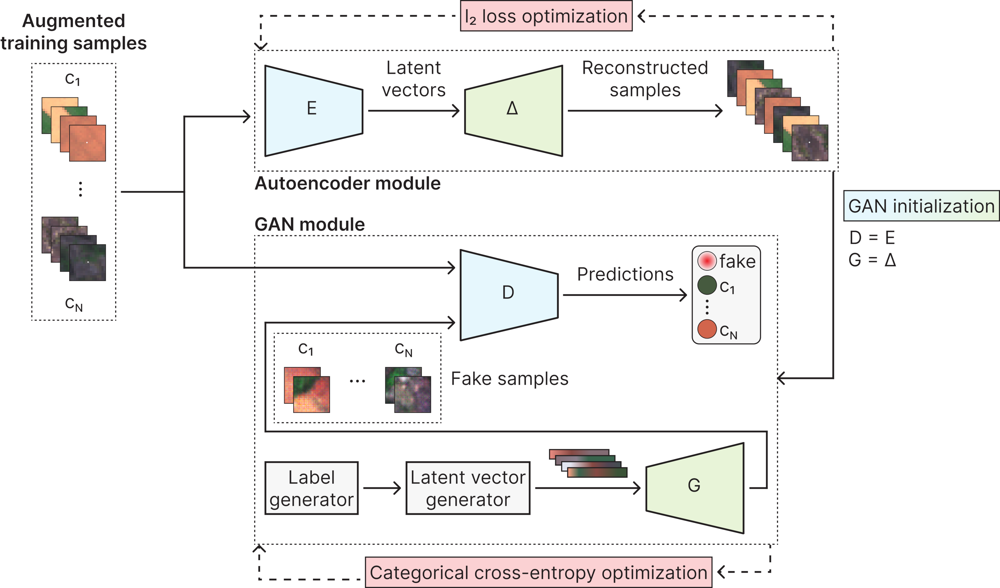
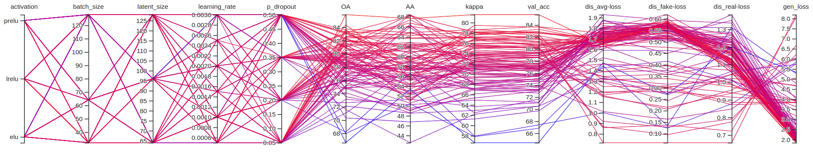
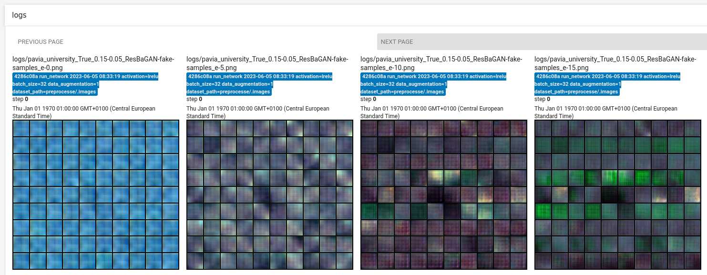

<!--
Copyright 2023 Álvaro Goldar Dieste

Licensed under the Apache License, Version 2.0 (the "License");
you may not use this file except in compliance with the License.
You may obtain a copy of the License at

    http://www.apache.org/licenses/LICENSE-2.0

Unless required by applicable law or agreed to in writing, software
distributed under the License is distributed on an "AS IS" BASIS,
WITHOUT WARRANTIES OR CONDITIONS OF ANY KIND, either express or implied.
See the License for the specific language governing permissions and
limitations under the License.
-->

<!-- 12:51 07/07/2023 -->


# ResBaGAN: a Residual Balancing GAN with data augmentation for forest mapping

Official PyTorch code release for ResBaGAN, introduced in:

> Á. G. Dieste, F. Argüello and D. B. Heras, "ResBaGAN: A Residual Balancing GAN with Data Augmentation for Forest
> Mapping," in IEEE Journal of Selected Topics in Applied Earth Observations and Remote Sensing, doi:
> 10.1109/JSTARS.2023.3281892. Available at: https://ieeexplore.ieee.org/document/10141632

If you have any questions, do not hesitate to contact at: [alvaro.goldar.dieste@usc.es](mailto:alvaro.goldar.dieste@usc.es)


## Table of contents

1. [About ResBaGAN](#about-resbagan)
2. [Installation](#installation)
    * [Prerequisites](#prerequisites)
    * [Downloading the code](#downloading-the-code)
    * [Installing the container](#installing-the-container)
    * [Downloading the datasets](#downloading-the-datasets)
    * [Running the container](#running-the-container)
3. [Usage](#usage)
    * [Example: preprocessing a dataset](#example--preprocessing-a-dataset)
    * [Example: training a network](#example--training-a-network)
    * [Example: comparing the performance of different models](#example--comparing-the-performance-of-different-models)
    * [Example: launching a TensorBoard instance to visualize experiments](#example--launching-a-tensorboard-instance-to-visualize-experiments)
    * [Example: testing the synthesis performance of a GAN](#example--testing-the-synthesis-performance-of-a-gan)
4. [Built with](#built-with)
5. [Authors](#authors)
6. [License](#license)
7. [Citation](#citation)


## About ResBaGAN

The Residual Balancing Generative Adversarial Network (ResBaGAN) is a novel method for remote sensing image
classification, which specifically addresses two significant challenges in this field for attaining high levels of
accuracy: limited labeled data and class imbalances. ResBaGAN achieves this by constructing a sophisticated data
augmentation framework on top of the powerful Generative Adversarial Network (GAN) architecture.

For a comprehensive understanding of ResBaGAN's capabilities, we strongly recommend reading the related research
paper. A brief overview, as given in the abstract, is provided below:

> Although deep learning techniques are known to achieve outstanding classification accuracies, remote sensing
> datasets often present limited labeled data and class imbalances, two challenges to attaining high levels of
> accuracy. In recent years, the Generative Adversarial Network (GAN) architecture has achieved great success as a
> data augmentation method, driving research toward further enhancements. This work presents the Residual Balancing
> Generative Adversarial Network (ResBaGAN), a GAN-based method for the classification of remote sensing images,
> designed to overcome the challenges of data scarcity and class imbalances by constructing an advanced data
> augmentation framework. This framework builds upon a GAN architecture enhanced with an autoencoder initialization
> and class balancing properties, a superpixel-based sample extraction procedure with traditional augmentation
> techniques, and an improved residual network as classifier. Experiments were conducted on large, very
> high-resolution multispectral images of riparian forests in Galicia, Spain, with limited training data and strong
> class imbalances, comparing ResBaGAN to other machine learning methods such as simpler GANs. ResBaGAN achieved
> higher overall classification accuracies, particularly improving the accuracy of minority classes with F1-score
> enhancements reaching up to 22%.


_Figure 1: Neural network architecture of ResBaGAN._


## Installation

### Prerequisites

For the sake of simplicity and reproducibility, this project integrates all code into a Docker image. Therefore, your
development environment will need to support:

* Docker.
* NVIDIA Container Toolkit (optional, but strongly recommended for CUDA acceleration).

### Downloading the code

For convenience, the code is locally stored and is provided to the Docker container through a volume mapping.
Therefore, you need to download or clone this repository:

```
git clone https://github.com/alvrogd/ResBaGAN.git
```

### Installing the container

You can build the Docker image locally by running the script `dockerfiles/build_container.sh`:

```
cd dockerfiles/
bash build_container.sh
```

Please be aware that the resulting image is large (~14.2 GB), so it will take some time to download all the required
dependencies.

### Downloading the datasets

_Data availability statement: Restrictions apply to the availability of the data used in this work. The datasets are
property of Babcock International and have been used with permission._

As the datasets used in the paper are not publicly available, we provide a modified version of the public Pavia
University dataset. Please note that ResBaGAN has not been tuned for the characteristics of this dataset, and so the
performace demonstrated by running this code is not representative of the results reported in the paper. Nonetheless,
it provides a useful way to test the code.

In particular, the Pavia University dataset has been modified to mirror the characteristics of the datasets used in the
paper:

- Only five out of the 103 bands have been kept. Specifically, the ones most close to 475 nm (blue), 560 nm (green),
  668 nm (red), 717 nm (red edge), and 842 nm (near-infrared).
- The spatial size has been increased by x13.0, to simulate the use of a very high-resolution sensor with a spatial
  resolution of 10 cm/pixel.

You can find the modified dataset at the link in `datasets/pavia_university/README.md`. Please download all files and
place them in the `datasets/pavia_university` directory:

- `dataset.raw`: the multispectral data.
- `ground_truth.raw`: the ground truth.
- `segmentation.raw`: the waterpixels segmentation.

The code in this repository is designed to work with a custom RAW format. For more information, refer to
`datasets/pavia_university/README.md`. The code also assumes that the segmentation has been precomputed and stored in
the `segmentation.raw` file. You can find an extensive list of implementations of segmentation algorithms at
https://github.com/davidstutz/superpixel-benchmark, including Waterpixels, the algorithm used in this study.

### Running the container

Before launching the container, you will need to adjust the contents of the provided convenience script
`dockerfiles/launch_container.sh` to suit your system configuration. In particular, you will need to:

- Update the volume mapping to make the project available to the container:

```
<<<
-v /home/alvaro.goldar/ResBaGAN:/opt/ResBaGAN \
>>>
-v /full/path/to/project:/opt/ResBaGAN \
```

- Adjust the port mapping if you intend to use the TensorBoard visualization tool.
- Reduce the shared memory size if you are running the container on a system with limited resources. This will require
  adjusting the number of PyTorch workers accordingly. 

Feel free to change any other parameters as needed. You can now launch the container and attach a bash terminal to it
by running:

```
./launch_container.sh bash
```


## Usage

Three different operations are available:

- `preprocess_dataset`: reads and prepares a given dataset for the next operations.
- `run_network`: trains a specific model on a preprocessed dataset and evaluates its classification performance.
- `test_synthesis`: evaluates the synthesis performance of a trained GAN model.

For convenience, the container integrates the Guild AI tool, which helps track experiments, compare results, and
automate runs. To learn more about the many features of Guild AI, such as batch files and others, please refer to its
[official documentation](https://my.guild.ai/docs).

### Example: preprocessing a dataset

Guild AI automatically parses available arguments and uses their default values unless otherwise specified:

```
root@cf04d7bcd5e7:/opt/ResBaGAN# guild run preprocess_dataset
You are about to run preprocess_dataset
  dataset: pavia_university
  segment: 1
  train_ratio: 0.15
  val_ratio: 0.05
Continue? (Y/n) n
```

You can change any parameter by appending its new value:

```
root@cf04d7bcd5e7:/opt/ResBaGAN# guild run preprocess_dataset train_ratio=0.25
You are about to run preprocess_dataset
  dataset: pavia_university
  segment: 1
  train_ratio: 0.25
  val_ratio: 0.05
Continue? (Y/n) n
```

To preprocess the modified Pavia University dataset that we downloaded earlier, with the same
training/validation/test split as in the paper, use:

```
root@cf04d7bcd5e7:/opt/ResBaGAN# guild run preprocess_dataset
You are about to run preprocess_dataset
  dataset: pavia_university
  segment: 1
  train_ratio: 0.15
  val_ratio: 0.05
Continue? (Y/n) y
Resolving file:datasets/
[*] Arguments: {'dataset': 'pavia_university', 'segment': 1, 'train_ratio': 0.15, 'val_ratio': 0.05}
[*] Loading dataset pavia_university from disk
        pavia_university dataset is in RAW format
[*] Recording available classes
[*] Starting preprocessing
[*] Segmenting dataset into superpixels
INFO: [cppimport.checksum] Failed to find compiled extension; rebuilding.
        [*] Reading segmentation map from disk
[*] Scaling dataset to [-1, 1]
[*] Splitting dataset into train, validation, and test sets: ratios (0.15, 0.05)
[*] Total samples: 25482
        [*] Recording samples for class asphalt (4670 items)
        [*] Recording samples for class meadows (8946 items)
        [*] Recording samples for class gravel (1319 items)
        [*] Recording samples for class trees (2887 items)
        [*] Recording samples for class painted_metal_sheets (932 items)
        [*] Recording samples for class bare_soil (2419 items)
        [*] Recording samples for class bitumen (734 items)
        [*] Recording samples for class self_blocking_bricks (2756 items)
        [*] Recording samples for class shadows (819 items)

[time] Loading and preprocessing: 4.216188178048469 s
[*] HyperDataset summary:
        Name: pavia_university
        Shape: (height) 7930, (width) 4420, (bands) 5
        Classes: ['asphalt', 'meadows', 'gravel', 'trees', 'painted_metal_sheets', 'bare_soil', 'bitumen', 'self_blocking_bricks', 'shadows']
        Classes count: 9
        Segmented: True
        Superpixels count: 99362
        Patch size: 32
        Ratios: (train) 0.15, (val) 0.05
        Samples count: (train) 3817, (val) 1275, (test) 20390

[*] Storing the preprocessed dataset on disk
[*] Done!
```

### Example: training a network

After preprocessing the dataset, we can train a network on it. For instance, let's train ResBaGAN:

```
root@cf04d7bcd5e7:/opt/ResBaGAN# guild run run_network
You are about to run run_network
  activation: lrelu
  batch_size: 32
  data_augmentation: 1
  dataset_path: preprocessed/hyperdataset
  epochs: 600
  latent_size: 128
  learning_rate: 0.001
  network: ResBaGAN
  num_workers: 4
  p_dropout: 0.05
  preprocess_dataset: 390216796a274471a77323157062e585
  weight_init: xavier
Continue? (Y/n) y
Resolving preprocess_dataset
Using run 390216796a274471a77323157062e585 for preprocess_dataset resource
[*] Arguments: {'dataset_path': 'preprocessed/hyperdataset', 'data_augmentation': 1, 'network': 'ResBaGAN', 'latent_size': 128, 'activation': 'lrelu', 'p_dropout': 0.05, 'weight_init': 'xavier', 'learning_rate': 0.001, 'epochs': 600, 'batch_size': 32, 'num_workers': 4, 'device': 'cuda:0'}
[*] HyperDataset summary:
	Name: pavia_university
	Shape: (height) 7930, (width) 4420, (bands) 5
	Classes: ['asphalt', 'meadows', 'gravel', 'trees', 'painted_metal_sheets', 'bare_soil', 'bitumen', 'self_blocking_bricks', 'shadows']
	Classes count: 9
	Segmented: True
	Superpixels count: 99362
	Patch size: 32
	Ratios: (train) 0.15, (val) 0.05
	Samples count: (train) 3817, (val) 1275, (test) 20390

(...)

[*] Training the autoencoder...:   0%|          | 0/600 [00:00<?, ?it/s]
                                                                        
[*] Training epoch: 1/600:
	Mean loss: 0.05576995237885664

(...)

[*] Training of the autoencoder finished!

[*] Training the networks...:   0%|          | 0/600 [00:00<?, ?it/s]
                                                                     
[*] Training epoch: 1/600:
	Discriminator's mean loss (average): 2.0705037901798886
	Discriminator's mean loss (real images): 1.582329705854257
	Discriminator's mean loss (fake images): 0.4881740894168615
	Generators's mean loss: 4.494466733932495
	Validation accuracy: 72.47058823529412 %

(...)

[*] Training finished!
[time] Training: 3760.6708436550107 s

(...)

[*] Computing pixel-level accuracies...
[*] Testing the network...
[acc] Overall Accuracy (OA): 92.79583220032083 %
[acc] Average Accuracy (AA): 93.11438384387698 %
[acc] Cohen's Kappa (k): 89.46302601571749 %
[acc] Confusion matrix:
                      asphalt  meadows  gravel   trees  painted_metal_sheets  bare_soil  bitumen  self_blocking_bricks  shadows  fake
asphalt                681992        0    2468       7                     0          0    28965                  9478        0     0
meadows                   129  2823659     648    9863                     0     130077        0                     0        0     0
gravel                   4740        0  190304       0                     0          0      420                 48036        0     0
trees                       8     7989       0  213912                    28          0        0                     0        3     0
painted_metal_sheets        0        0       0       0                163992          0        0                     0      227     0
bare_soil                1286   144662       0    1063                  1101     660969        0                  2501        0     0
bitumen                  7977        0     497       0                     0          0   172520                    27        0     0
self_blocking_bricks     1269        0    6480       0                    10          0        0                304770        0     0
shadows                     0        0       0     155                     0          0        0                     4    70552     0
fake                        0        0       0       0                     0          0        0                     0        0     0
[time] Testing (pixel-level accuracies): 139.57294777303468 s
```

The model's accuracy is automatically measured at the end of the training, reporting the Overall Accuracy (OA),
Average Accuracy (AA), Cohen's Kappa, and the confusion matrix.

The table below shows all the tested models in the paper, their corresponding accuracies, and the appropriate command
to run them. Keep in mind that the accuracies obtained when running this code on the modified Pavia University dataset
may differ significantly.

| Model           | Average OA | Average AA | Average Kappa | Command                                                            |
|-----------------|------------|------------|---------------|--------------------------------------------------------------------|
| CNN             | 92.17      | 73.83      | 86.47         | `guild run run_network network=CNN2D data_augmentation=0`          |
| Improved ResNet | 94.61      | 83.00      | 90.86         | `guild run run_network network=CNN2D_Residual data_augmentation=0` |
| ACGAN           | 88.92      | 77.14      | 81.98         | `guild run run_network network=ACGAN data_augmentation=0`          |
| BAGAN           | 94.13      | 80.67      | 89.96         | `guild run run_network network=BAGAN data_augmentation=0`          |
| ResBaGAN        | **95.59**  | **88.30**  | **92.53**     | `guild run run_network network=ResBaGAN`                           |

Let's also train the Improved ResNet:

```
root@cf04d7bcd5e7:/opt/ResBaGAN# guild run run_network network=CNN2D_Residual data_augmentation=0
You are about to run run_network
  activation: lrelu
  batch_size: 32
  data_augmentation: 0
  dataset_path: preprocessed/hyperdataset
  epochs: 600
  latent_size: 128
  learning_rate: 0.001
  network: CNN2D_Residual
  num_workers: 4
  p_dropout: 0.05
  preprocess_dataset: 390216796a274471a77323157062e585
  weight_init: xavier
Continue? (Y/n) y
Resolving preprocess_dataset
Using run 390216796a274471a77323157062e585 for preprocess_dataset resource
[*] Arguments: {'dataset_path': 'preprocessed/hyperdataset', 'data_augmentation': 0, 'network': 'CNN2D_Residual', 'latent_size': 128, 'activation': 'lrelu', 'p_dropout': 0.05, 'weight_init': 'xavier', 'learning_rate': 0.001, 'epochs': 600, 'batch_size': 32, 'num_workers': 4, 'device': 'cuda:0'}

(...)

[*] Training finished!
[time] Training: 1007.9784623520682 s

(...)

[*] Computing pixel-level accuracies...
[*] Testing the network...
[acc] Overall Accuracy (OA): 93.44198308456242 %
[acc] Average Accuracy (AA): 92.12038102554023 %
[acc] Cohen's Kappa (k): 90.2397985434779 %
[acc] Confusion matrix:
                      asphalt  meadows  gravel   trees  painted_metal_sheets  bare_soil  bitumen  self_blocking_bricks  shadows  fake
asphalt                684604        7    9578      50                     0         32    14326                 14313        0     0
meadows                    10  2927249     381     845                     0      35891        0                     0        0     0
gravel                   1482        0  202191       0                     0          0        0                 39827        0     0
trees                      10    17241       0  204638                     0         51        0                     0        0     0
painted_metal_sheets        0        0      27       0                164190          0        0                     0        2     0
bare_soil                   0   202875       0     773                     0     605961        0                  1973        0     0
bitumen                 11980        0     114       0                     0          0   167882                  1045        0     0
self_blocking_bricks      196        6   19813      41                     0         49        0                292424        0     0
shadows                   295        0       0      95                     0          2        0                     4    70315     0
fake                        0        0       0       0                     0          0        0                     0        0     0
[time] Testing (pixel-level accuracies): 135.44658876303583 s
```

### Example: comparing the performance of different models

Guild AI records several metrics across all experiments, which can be then conveniently compared inside the terminal: 

```
root@cf04d7bcd5e7:/opt/ResBaGAN# guild compare
 (1,1) run                  75672e0e
───────────────────────────────────────────────────────────────────────────────────────────────────────────────────────────────────────────────────────────────────────────────────────────────────────────────────────────────────────────────────────────────────────────────────────────────────────────────────────────────────────────────────────
run       operation           started              time     status     label                 activation  batch_size  data_augmen…  dataset_path          epochs  latent_size  learning_ra…  network         num_workers  p_dropout  preprocess_dataset    weight_init  step  aa         kappa      oa         standalone_…  val_acc    dis_avg-loss  d…
75672e0e  run_network         2023-06-05 09:46:17  0:19:10  completed  activation=lrelu ba…  lrelu       32          0             preprocessed/hyperd…  600     128          0.001         CNN2D_Residual  4            0.05       390216796a274471a77…  xavier       600   92.120384  90.239799  93.441986  0.006770      91.764709
4286c08a  run_network         2023-06-05 08:33:19  1:05:08  completed  activation=lrelu ba…  lrelu       32          1             preprocessed/hyperd…  600     128          0.001         ResBaGAN        4            0.05       390216796a274471a77…  xavier       600   93.114387  89.463027  92.795829  8.423376e-05  91.137252  0.270148      0…
39021679  preprocess_dataset  2023-06-05 08:32:11  0:00:05  completed  dataset=pavia_unive…
```

### Example: launching a TensorBoard instance to visualize experiments

TensorBoard is a powerful tool for visualizing the training process of neural networks. It is included in the Docker
image, and Guild AI allows an effortless integration by just running:

```
root@cf04d7bcd5e7:/opt/ResBaGAN# guild tensorboard -p 6006
Preparing runs for TensorBoard
Running TensorBoard 2.8.0 at http://cf04d7bcd5e7:6006 (Type Ctrl+C to quit)
```

You can now access the TensorBoard web UI by opening `http://localhost:6006` in your browser.

In TensorBoard, you can further examine the model performance, visualize the evolution of training metrics, and even
render the samples generated by GAN models. Below are some screenshots of the TensorBoard web UI. To learn more about
its many features, please refer to its [official documentation](https://www.tensorflow.org/tensorboard/).


_Figure 2: Hyperparameter Tuning using the HParams Dashboard in TensorBoard._


_Figure 3: Evolution of the synthetic samples generated by ResBaGAN during its first epochs, visualized in
TensorBoard._

### Example: testing the synthesis performance of a GAN

To compute the Fréchet Inception Distance (FID) score of the previously trained ResBaGAN, you will also need the
trained Improved ResNet to act as judge.

First, obtain the IDs of the experiments by running:

```
root@cf04d7bcd5e7:/opt/ResBaGAN# guild runs
[1:75672e0e]  run_network         2023-06-05 09:46:17  completed  activation=lrelu batch_size=32 data_augmentation=0 dataset_path=preprocessed/hyperdataset epochs=600 latent_size=128 learning_rate=0.001 network=CNN2D_Residual num_workers=4 p_dropout=0.05 preprocess_dataset=390
[2:4286c08a]  run_network         2023-06-05 08:33:19  completed  activation=lrelu batch_size=32 data_augmentation=1 dataset_path=preprocessed/hyperdataset epochs=600 latent_size=128 learning_rate=0.001 network=ResBaGAN num_workers=4 p_dropout=0.05 preprocess_dataset=390216796
[3:39021679]  preprocess_dataset  2023-06-05 08:32:11  completed  dataset=pavia_university segment=1 train_ratio=0.15 val_ratio=0.05
```

Next, locate the trained Improved ResNet model in the `.guildai/runs/75672e0e.../logs` directory and copy it to the
root of the project. Now, you can calculate the FID score against the `run_network` operation of the ResBaGAN model
with this command:

```
root@cf04d7bcd5e7:/opt/ResBaGAN# guild run test_synthesis run_network=4286c08a
Refreshing flags...
You are about to run test_synthesis
  batch_size: 32
  model_path: logs/ResBaGAN_model.pt
  network: ResBaGAN
  num_workers: 4
  reference_model_path: CNN2D_Residual_model.pt
  run_network: 4286c08ab1f14d43aee7fe340ab27dbb
Continue? (Y/n) y
Resolving run_network
Using run 4286c08ab1f14d43aee7fe340ab27dbb for run_network resource
Resolving file:CNN2D_Residual_model.pt
[*] Arguments: {'dataset_path': 'preprocessed/hyperdataset', 'data_augmentation': 0, 'network': 'ResBaGAN', 'latent_size': 128, 'activation': 'lrelu', 'p_dropout': 0.05, 'weight_init': 'xavier', 'learning_rate': 0.001, 'epochs': 600, 'batch_size': 32, 'num_workers': 4, 'device': 'cuda:0', 'model_path': 'logs/ResBaGAN_model.pt', 'reference_model_path': 'CNN2D_Residual_model.pt'}

(...)

[*] Computing FID score for [C0] asphalt
        4670 samples gathered
        FID score: 524.7460410005529
[*] Computing FID score for [C1] meadows
        8946 samples gathered
        FID score: 1203.1810880620724
[*] Computing FID score for [C2] gravel
        1319 samples gathered
        FID score: 609.5813959573154
[*] Computing FID score for [C3] trees
        2887 samples gathered
        FID score: 1087.7824126219948
[*] Computing FID score for [C4] painted_metal_sheets
        932 samples gathered
        FID score: 473.9585932374859
[*] Computing FID score for [C5] bare_soil
        2419 samples gathered
        FID score: 1134.7791612940628
[*] Computing FID score for [C6] bitumen
        734 samples gathered
        FID score: 485.49831912077207
[*] Computing FID score for [C7] self_blocking_bricks
        2756 samples gathered
        FID score: 640.6822166172934
[*] Computing FID score for [C8] shadows
        819 samples gathered
        FID score: 303.8618414764222
```


## Built with

This project uses the following key technologies:

* [Python](https://github.com/python/cpython) - The primary language for deep learning as of 2023.
* [PyTorch](https://github.com/pytorch/pytorch) - Used for all deep learning machinery.
* [Guild AI](https://github.com/guildai/guildai) - Assists in experiment management.
* [mseitzer/pytorch-fid](https://github.com/mseitzer/pytorch-fid) - To compute the FID metric for GANs.
* [Docker](https://github.com/docker) - Enables a reproducible development environment.
* [cppimport](https://github.com/tbenthompson/cppimport) - To use C++ code from Python.

This software also relies on many other invaluable libraries including: [numpy](https://github.com/numpy/numpy),
[pandas](https://github.com/pandas-dev/pandas), [pybind11](https://github.com/pybind/pybind11),
[scikit-learn](https://github.com/scikit-learn/scikit-learn), [scipy](https://github.com/scipy/scipy),
[torchsummary](https://github.com/tyleryep/torchinfo), [torchvision](https://github.com/pytorch/vision),
[tqdm](https://github.com/tqdm/tqdm).


## Authors

* Álvaro G. Dieste:
  * Corresponding author of the paper, developer of the code, and maintainer of this repository.
  * [Email](mailto:alvaro.goldar.dieste@usc.es) - [GitHub](https://github.com/alvrogd) - [Google Scholar](https://scholar.google.es/citations?user=67EOjqYAAAAJ) - [LinkedIn](https://www.linkedin.com/in/alvrogd/) - [ORCID](https://orcid.org/0000-0002-6429-7283).

* Francisco Argüello:
  * Co-author of the paper.
  * [Email](mailto:francisco.arguello@usc.es) - [Google Scholar](https://scholar.google.es/citations?user=F9bhqcoAAAAJ) - [ORCID](https://orcid.org/0000-0001-9279-5426).

* Dora B. Heras:
  * Co-author of the paper. 
  * [Email](mailto:dora.blanco@usc.es) - [Google Scholar](https://scholar.google.es/citations?user=4I73qTwAAAAJ) - [LinkedIn](https://www.linkedin.com/in/dora-blanco-heras-b0374b5b) - [ORCID](https://orcid.org/0000-0002-5304-1426).
  

## License

This project is licensed under the Apache License 2.0 - see the [LICENSE](LICENSE) file for details.


## Citation

If you find this work useful, please consider citing it:

```
@ARTICLE{10141632,
  author={Dieste, Álvaro G. and Argüello, Francisco and Heras, Dora B.},
  journal={IEEE Journal of Selected Topics in Applied Earth Observations and Remote Sensing}, 
  title={ResBaGAN: A Residual Balancing GAN with Data Augmentation for Forest Mapping}, 
  year={2023},
  volume={16},
  number={},
  pages={6428-6447},
  doi={10.1109/JSTARS.2023.3281892}
}
```
